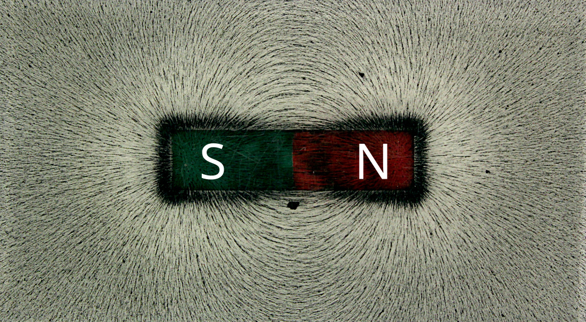
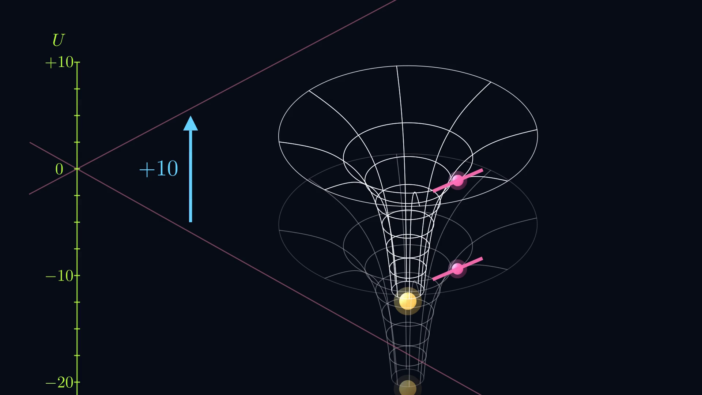
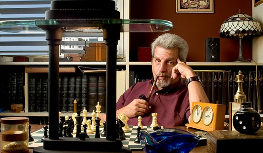
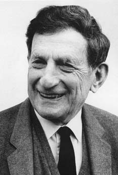
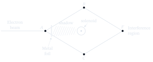
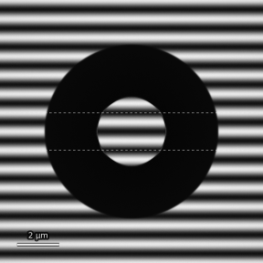

## How do we observe a field?

{
  width="100%"
  fig-alt="Iron filings revealing the magnetic field around a bar magnet"
}

::: {.notes}
**Timing: 0:15–0:45 (30 seconds; cumulative 0:45)**

*Stage cue: Indicate the iron filings close to one pole, then trace the overall pattern.*

This is the familiar way of making a magnetic field visible. Each iron filing
acts as a small, local probe: it responds where the field is, and together the
filings reveal a pattern. This captures the classical intuition that a field
is known through the force it produces at each point. The question for this
talk is whether local probes always reveal all the physically relevant
information.
:::


## From forces to potentials

A force is **conservative** when its effect can be encoded in a scalar function:

$$
\mathbf F = - \nabla U
$$

Here \(U\) is the **potential energy** of the probe.

But \(U\) depends on the probe itself.
For gravity near Earth:

$$
U(y)=mgy
$$

So we separate the field from the probe:

$$
\phi(\mathbf r)=\frac{U(\mathbf r)}{m}
\qquad \Rightarrow \qquad
\mathbf g = -\nabla \phi
$$

::: {.fragment}
**Potential:** field information, independent of the test body.
:::

::: {.notes}
**Timing: 0:45–1:30 (45 seconds; cumulative 1:30)**

*Stage cue: Point first to \(\mathbf F=-\nabla U\), then to the division by \(m\).*

To reach that question, let me first recall what a potential does. For a
conservative force, the force is minus the gradient of a potential energy.
The gradient is simply the slope: it tells us how rapidly the potential
changes and in which direction.

But potential energy belongs partly to the probe. Near Earth,
\(U=mgy\), so doubling the mass doubles \(U\), although the gravitational
field has not changed. Dividing by the mass leaves the gravitational
potential \(\phi\), with \(\mathbf g=-\nabla\phi\). The potential stores
information about the field independently of the object used to probe it.
:::


## Only potential differences matter {.potential-shift-slide background-color="#070D17"}

:::: {.r-stack .potential-stack}

::: {.potential-copy .fragment .fade-out data-fragment-index="1"}

The gravitational field depends on the **slope** of the potential,
not on its absolute height.

$$
\mathbf g(\mathbf r)=-\nabla\Phi(\mathbf r)
$$

$$
\Phi'(\mathbf r)=\Phi(\mathbf r)+\boxed{C}
\quad\Longrightarrow\quad
\mathbf g'=-\nabla(\Phi+\boxed{C})=\mathbf g
$$

<div class="takeaway">
A constant shift changes the reference level, not the physics.
</div>

:::

::: {.potential-video .fragment data-fragment-index="1"}

```{=html}
<video class="potential-video-live" controls preload="auto" data-autoplay>
  <source src="assets/videos/ConstantShiftScene.mp4" type="video/mp4">
</video>

```

:::

::::

::: {.notes}
**Timing: 1:30–2:10 (40 seconds; cumulative 2:10)**

There is already a redundancy here. The force depends on the slope of the
potential, not on its absolute height. If I add the same constant \(C\)
everywhere, its gradient is zero, so the field is unchanged.

*Stage cue: Advance the fragment and let the constant-shift animation run for a few seconds.*

The animation moves the whole potential vertically, but it never changes its
slope. This is like changing the zero on a height scale: the numerical labels
change, while every measurable trajectory stays the same.
:::


## Different potentials can produce the same field

<div class="slide-intro">
In gravity, adding a constant to the potential does not change the physical field.
</div>

:::: {.columns .v-center}
::: {.column width="48%"}

<div class="formula-label">Potential shift</div>

$$
V' = V + C
$$

$$
\mathbf g = -\nabla V
$$

:::

::: {.column width="48%"}

<div class="formula-label">Field unchanged</div>

$$
\mathbf g' = -\nabla V'
$$

$$
= -\nabla (V + C) = \mathbf g
$$

:::
::::

<div class="takeaway">
Only differences in potential affect the field.
</div>

::: {.notes}
**Timing: 2:10–2:35 (25 seconds; cumulative 2:35)**

So \(V\) and \(V+C\) are not two different physical situations. They are two
descriptions of the same field. That simple freedom to choose a reference
level is the first example of what we mean by a gauge freedom. In
electromagnetism, the freedom is much larger.
:::

## Electromagnetism: more freedom, same fields {.em-gauge-slide}

<div class="em-intro">

Electromagnetism needs **two potentials**:
$V$, the electric scalar potential, and
$\mathbf A$, the magnetic vector potential.

</div>

::: {.em-field-equations}
$$
\mathbf E
=
-\nabla V
-
\frac{\partial\mathbf A}{\partial t},
\qquad
\mathbf B
=
\nabla\times\mathbf A
$$
:::

<div class="change-label">

Now change the two potentials together:

</div>

::: {.em-gauge-transform}
$$
\mathbf A'
=
\mathbf A+\nabla\chi,
\qquad
V'
=
V-\frac{\partial\chi}{\partial t}
$$
:::

<div class="chi-note">

$\chi(\mathbf r,t)$ may be any scalar function.

</div>

::: {.same-fields .fragment data-fragment-index="1"}
$$
\mathbf E'=\mathbf E,
\qquad
\mathbf B'=\mathbf B
$$
:::

::: {.gauge-definition .fragment data-fragment-index="2"}
<span class="gauge-term">Gauge freedom</span> is the freedom to use
different potentials to describe exactly the same physical fields.
:::

::: {.notes}
**Timing: 2:35–3:35 (60 seconds; cumulative 3:35)**

*Stage cue: Follow the two field equations from left to right. Do not derive them.*

Electromagnetism requires two potentials: the scalar potential \(V\) and the
vector potential \(\mathbf A\). The electric field comes from a spatial
change in \(V\) and a time change in \(\mathbf A\); the magnetic field is the
curl of \(\mathbf A\).

Now choose any scalar function \(\chi(\mathbf r,t)\). If we add its gradient
to \(\mathbf A\), while subtracting its time derivative from \(V\), the extra
terms cancel in both field equations.

*Stage cue: Advance both fragments: first the unchanged fields, then the definition.*

Therefore \(\mathbf E\) and \(\mathbf B\) are exactly unchanged. This is a
gauge transformation. The value of a potential at one point is not itself an
observable; many pairs of potentials represent the same electromagnetic
fields. Classically, that makes the potentials look like useful bookkeeping
rather than physical actors.
:::

## Quantum mechanics uses the potentials directly {.schrodinger-potentials}

The wavefunction evolves according to Schrödinger's equation:

$$
i\hbar\frac{\partial \psi}{\partial t}
=
\hat H\psi
$$

::: {.qm-particle-equation}
For a charged particle in an electromagnetic field:

$$
i\hbar\frac{\partial\psi}{\partial t}
=
\left[
\frac{1}{2m}
\left(
-i\hbar\nabla
-
q\boxed{\mathbf A}
\right)^2
+
q\boxed{V}
\right]\psi
$$
:::

::: {.qm-takeaway}
The equation contains the potentials $V$ and $\mathbf A$ directly.
:::

::: {.notes}
**Timing: 3:35–4:25 (50 seconds; cumulative 4:25)**

*Stage cue: Indicate only the two highlighted quantities \(\mathbf A\) and \(V\).*

Quantum mechanics changes the emphasis. A particle is described by a
wavefunction, and its evolution is generated by the Hamiltonian in
Schrödinger's equation. For a particle with charge \(q\), the Hamiltonian
contains \(V\) and \(\mathbf A\) directly, in the combination shown here.

This does not mean that a gauge-dependent value suddenly becomes measurable.
Under a gauge transformation, the wavefunction changes its phase as well, and
all probabilities remain unchanged. But it does mean that the potentials can
write information into a *relative phase*. Relative phase is observable
through interference, and that is the opening exploited by Aharonov and Bohm.

**Timing checkpoint:** leave the foundations at about **4:25**. If you are
late, omit the final two sentences on the previous slide; do not cut the setup
or the animation.
:::


## Aharonov’s intuition {.ab-intuition-slide}

<div class="phase-one-liner">
The absolute phase of a wavefunction is not directly measurable — but phase differences are.
</div>

<div class="intuition-layout">

<div class="intuition-text">

<div class="intuition-kicker">The uncomfortable point</div>

In the Schrödinger equation, the particle does not couple directly to
$\mathbf E$ and $\mathbf B$, but to the potentials:

$$
\hat H =
\frac{1}{2m}
\left(-i\hbar\nabla - q\mathbf A\right)^2
+ qV
$$

<div>

Replacing potentials with fields means differentiating:

$$
\mathbf B = \nabla \times \mathbf A
$$

and differentiation can erase information.

</div>

<div class="fragment fade-up intuition-question">
Can a quantum phase detect information that the fields have lost?
</div>

</div>

<div class="scientists-mini">

<figure>

<figcaption>Yakir Aharonov</figcaption>
</figure>

<figure>

<figcaption>David Bohm</figcaption>
</figure>

</div>

</div>

::: {.notes}
**Timing: 4:25–5:35 (70 seconds; cumulative 5:35)**

An overall phase of a wavefunction cannot be measured, just as rotating every
hand on a set of identical clocks by the same angle changes no comparison.
But split the wave into two branches and recombine them, and the difference
between their phases controls whether they reinforce or cancel.

Aharonov and Bohm focused on the relation
\(\mathbf B=\nabla\times\mathbf A\). Taking a derivative can erase global
information. In an ordinary region that missing information can be removed by
a gauge choice. But if the accessible region has a hole, a loop around that
hole cannot be shrunk to a point. Then \(\mathbf A\) cannot be gauged away
everywhere around the loop, even when \(\mathbf B\) vanishes at every point on
it. What remains is the circulation of \(\mathbf A\) around the complete loop.

*Stage cue: Advance the question fragment; pause for one beat.*

So their question was: can a quantum phase recover precisely this information
that the local field has lost?
:::

---

## The magnetic Aharonov–Bohm setup {.ab-setup-slide}

:::: {.setup-layout}
::: {.setup-visual}

:::

::: {.setup-copy}

- **Split at \(A\).** A metal foil divides one coherent beam into two.
- **Flux locked inside.** The solenoid holds \(\Phi_B\); its shadow keeps the electrons out.
- **Nothing to feel.** Along both paths \(\mathbf B=0\) — but \(\mathbf A\neq 0\).
- **Yet \(F\) moves.** The fringes shift all the same.

:::
::::

::: {.setup-phase}
$$
\Delta\varphi
=
\frac{q}{\hbar}
\oint_C \mathbf A\cdot d\mathbf r
=
\frac{q\Phi_B}{\hbar}
$$

The phase records the **enclosed magnetic flux**, not a local magnetic field.
:::

::: {.notes}
**Timing: 5:35–8:00 (145 seconds; cumulative 8:00)**

*Stage cue: Trace the apparatus in order: \(A\), upper and lower paths, the
shielded solenoid, then \(F\).*

Here is the magnetic arrangement. At \(A\), a coherent electron beam is split
into two wave packets. One passes above the solenoid, through \(B\); the other
passes below it, through \(C\). The solenoid is shielded, and the two packets
recombine at \(F\), where they form an interference pattern.

The crucial separation is this: the magnetic flux \(\Phi_B\) is confined
inside the solenoid, while the electrons travel only outside. Along both
paths, \(\mathbf B=0\). The magnetic Lorentz force
\(q\mathbf v\times\mathbf B\) is therefore zero, so neither packet is
accelerated. Classically, two static experiments with different hidden fluxes
should therefore give the same result.

Quantum mechanically, each branch accumulates a phase

\[
\frac{q}{\hbar}\int \mathbf A\cdot d\mathbf r.
\]

The phase assigned to either open path depends on the gauge, so it is not an
observable by itself. At \(F\), however, we subtract the two phases. The two
open paths then form one closed loop, and the difference becomes

\[
\Delta\varphi
=\frac{q}{\hbar}\oint_C \mathbf A\cdot d\mathbf r.
\]

The integral of a gradient around a closed loop is zero, so this quantity is
gauge invariant. By Stokes' theorem, the circulation equals the magnetic flux
enclosed by the loop. Therefore

\[
\Delta\varphi=\frac{q\Phi_B}{\hbar}.
\]

*Stage cue: Point to the final displayed equation, then to the interference region at \(F\).*

This is the effect in one line. The electrons encounter no magnetic field and
feel no force, yet changing an inaccessible enclosed flux changes their
relative phase. That phase shifts the interference fringes rigidly: it changes
their position, not their spacing or their envelope. For an electron, the
charge only fixes the direction of the shift; the existence of the shift is
the central result.

**Timing checkpoint:** reach the interactive animation at about **8:00**.
This is the main explanatory checkpoint of the talk.
:::


## The Aharonov–Bohm effect in motion {.ab-animation-slide}

```{=html}

```

::: {.notes}
**Timing: 8:00–10:10 (130 seconds; cumulative 10:10)**

*Stage cue: Select `present` and set \(\Phi/\Phi_0=0\). Point to the two green
arms, the amber solenoid, the red circulation lines, and the screen.*

This animation separates the ingredients. Treat each slider position as a
separate static experiment. The green waves follow the two electron paths.
Notice that they have exactly the same wavelength in both arms, because no
force changes the electrons' momentum. The magnetic field is confined to the
amber solenoid. The red circles represent the vector potential outside it:
their curl is zero along the paths, but their circulation around the excluded
region need not be zero.

*Stage cue: Press \(\tfrac12\), or move the slider slowly to
\(\Phi/\Phi_0=\tfrac12\). Use the dashed screen markers as the reference.*

It is useful to express the flux in units \(\Phi_0=h/e\). Then the magnitude
of the electron phase is

\[
|\Delta\varphi|=2\pi\frac{\Phi_B}{\Phi_0}.
\]

At half a flux quantum, the relative phase is \(\pi\). The maxima become
minima, and the entire fringe pattern moves by half a spacing. The dashed
marks show where the maxima were at zero flux.

*Stage cue: Press \(1\). Pause just long enough for the audience to compare
the pattern with the dashed reference.*

At one flux quantum, the phase is \(2\pi\). That is one complete phase cycle,
so the interference pattern is physically identical to the pattern at zero
flux. The response is periodic in the enclosed flux.

*Stage cue: Select `collect`, then press \(\tfrac12\). Let the dots accumulate
while delivering the next paragraph; do not wait in silence for a full screen.*

The individual electron impacts are random, but as they accumulate, the
shifted interference fringes emerge statistically. Nothing here says that a
force bends the electron paths or changes their energy. The flux changes the
relative phase, and the relative phase changes the interference probability.
That distinction is the essence of the Aharonov–Bohm effect.
:::

## Tonomura’s toroidal experiment {.tonomura-slide}

:::: {.tonomura-layout}

::: {.tonomura-visual}
{.tonomura-figure fig-align="center"}
:::

::: {.tonomura-copy}

**The loophole:**
real solenoids leak small magnetic fields.

**Tonomura’s idea:**
replace the solenoid with a **closed toroidal magnet**.

::: {.tonomura-field}
$$
B = 0 \quad \text{along the electron paths}
$$
:::

::: {.tonomura-phase}
$$
\Delta \varphi
= \frac{q}{\hbar}\oint_C \mathbf A\cdot d\mathbf r
= \frac{q\Phi_B}{\hbar}
$$
:::

:::

::::

::: {.tonomura-takeaway .fragment}
The electrons never cross the magnetic field,
but the interference fringes still shift.
:::

::: {.notes}
**Timing: 10:10–11:40 (90 seconds; cumulative 11:40)**

*Stage cue: Indicate the closed toroid first, then the electron paths and the
shifted fringes in the hole.*

There is an obvious experimental objection. A real straight solenoid is
finite, so a small magnetic field may leak from its ends. Perhaps that stray
field, rather than the enclosed flux, acts locally on the electrons.

Tonomura and collaborators closed this loophole in 1986. They replaced the
straight solenoid with a microscopic toroidal magnet: a closed ring with no
ends. A superconducting niobium layer confined the magnetic flux, and a copper
coating prevented the electron wave from entering the magnet. One part of the
electron wave passed through the hole and the other outside, while both
remained in regions where \(\mathbf B=0\).

The superconducting flux is quantised in units of \(h/2e\). An odd number of
these units gives an electron phase difference of \(\pi\); an even number
gives zero modulo \(2\pi\). In this schematic, the dashed guides make the odd
case visible as a shift by exactly half a fringe spacing.

*Stage cue: End by looking back at the audience, not at the equation.*

The electrons never cross the magnetic field, but their interference pattern
still records the flux it encloses. The stray-field explanation is removed,
and the phase shift remains.
:::


## Thank you for your attention {.thank-you-slide}

::: {.notes}
**Timing: 11:40–12:00 (20 seconds; cumulative 12:00)**

So the effect does not make a particular gauge, or the value of
\(\mathbf A\) at one point, observable. What is observable is the
gauge-invariant phase around a closed loop. Quantum interference can therefore
detect enclosed electromagnetic flux even when the field vanishes everywhere
along the particle's path. Thank you.
:::


## Sources {.sources-slide}

::: {#refs}
:::

::: {.notes}
**Timing checkpoint:** target finish **12:00**. Leave this Sources slide visible
during questions if a reference is requested.
:::
